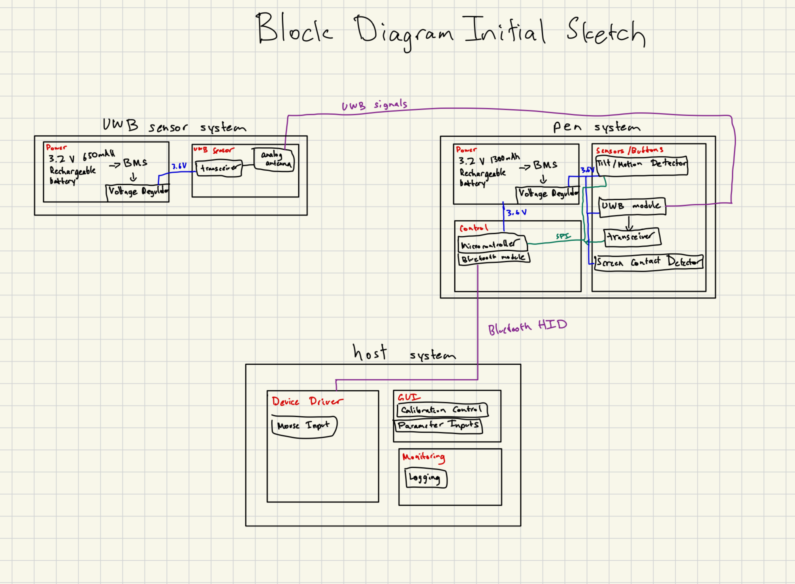
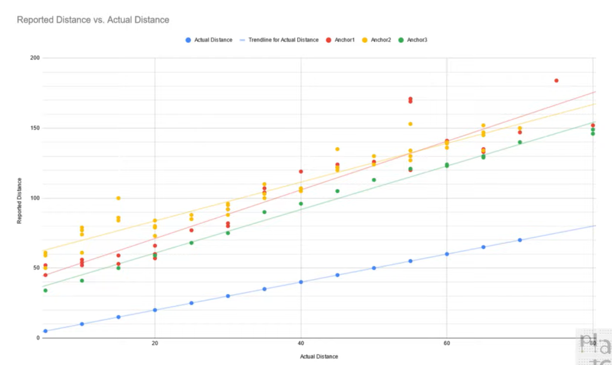
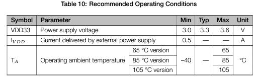
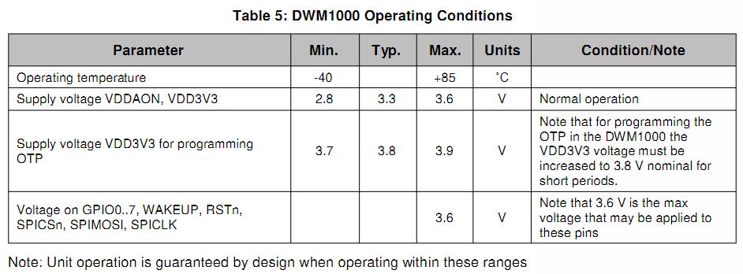
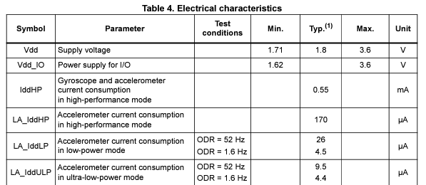
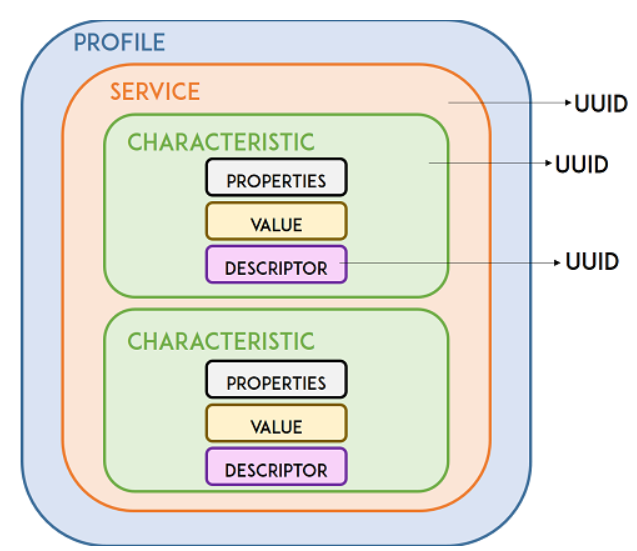

# Table of Contents (Dates)

[TOC]
Note: Github doesn't automatically support rendering of Table of Contents, but you can click the outline option in the top right of this viewing window to view/jump to headings

## 9/15 (Meeting)

We constructed a rough draft of our block diagram in order to start making connections between subsystems and fleshing out the details of our project.  Below is a rough draft of what we think the design should look like, but anticipate much discussion over the following weeks that will change up how the subsystems are designed and how they communicate with each other.

## 9/16 (Individual)

Spoke to Greg from the machine shop and briefly explained our project.  The physical aspects of our projects aside from the PCB design and wiring/soldering include designing an enclosure for both the sensor modules and the pen.  The sensor modules can probably be a standard pre-made enclosure which we will have to find a unique way to dynamically mount on various monitors and screens.  However, the pen will probably have to be 3D printed since it should be a specific ergonomic shape that a person can hold and also because we will need to custom place the tip and buttons in relation to the PCB (which would be a challenge with standard enclosures).  Greg mentioned that they don't do 3D printing at the machine shop but that there are several places on campus that offer regular and metal 3D printing.  We will probably defer the design of the enclosure until after we've developed our PCB and sent it for printing. Metal 3D printing may not be an option if it interferes with the transmitting and receiving of UWB signals.

## 9/18 (Meeting)

Sakhi and I finished significant portions of our project proposal in today's meeting.  We discussed several aspects of our projects while fleshing out the details:

* Choice of microcontroller
  * We looked at several microcontrollers including the STM32F407 and the ESP32-S3.  We need a microcontroller that has a HID interface so that it is easier to convert our location data to mouse interactions.  However, we are still debating whether our method of connection should be USB HID or Bluetooth (BLE) HID. The STM option is widely used for DSP and sensor fusion.  However, we can probably simplify our PCB design by using BLE HID. Since the ESP32-S3-WROOM has an integrated BLE transceiver which will allow for easier communication between UWB modules as well.  There are existing libraries that set up this communication so the software development will not be from scratch.
  * We also discussed how we'll filter data to create smooth mouse movement.  Example positioning projects of UWB sensors online see "jerks" and lots of variance in location jittering. [Example (at 43:50).](https://youtu.be/-GNkobAxao0?t=2630&si=Q2I53SLyXyVUxD48)  However, given that we want almost instantaneous mouse location updates on the screen, we are worried that doing any advanced filtering will introduce significant latency to our system.  We may proceed with a more simple "filtering" by excluding data points that are clearly outliers or using sensor fusion to adjust outlying location data.  With this in mind, we may not need the capabilities of the STM32 option which is more popular for DSP.
* Another important discussion we had was around our mouse positioning accuracy (how close the cursor is to the location of the pen's tip). 
  * Given a 15.9" screen size with dimensions of 13.86" x 7.80", we'd expect the mouse  cursor, at least for initial prototypes, to be within a 1cm radius of the pen tip. This would allow us a 5% error in the pen-to-mouse cursor translation during our development period. 
  * Another topic of importance is the calibration of the UWB sensors which severely affect accuracy.  Out of the box, the sensors are not accurate.  Below is a graph of the UWB sensors detected position vs actual distance from an accuracy test done in this [video (at 9:13).](https://youtu.be/-GNkobAxao0?t=553&si=dBFYW62ZgwTIBGEz) You can see that straight out of box, the UWB sensors report a distance of up to 60cm when the actual distance is actually 0cm.  This location sensing error is quite large (especially for our project where we expect sub-centimeter accuracy) and the graph even shows out-of-the-box sensing differences between sensors of the same model.  Thus we will have to offset the location data to pass through the origin in order to accurately map it to the actual distance.  Combining this calibration with sensor fusion and adjustment of outlier data, we should get the accuracy we are looking for.

## 9/19 (Meeting)

finish proposal and proof read
choose microcontroller and investigate if makerfab library can work on any esp mcu
since the anchors need to know when to communicate and when to receive/transmit signals, we need microcontrollers there. bluetooth already integrated so it makes sense to leverage that for communication with the pen subsystem and with host --> yet another reason for full wireless scheme
investigate uwb ranging algorithms
use calibration and accelerometer to "denoise" data and identify outliers
finish block diagram and make it look pretty
format the entire proposal
add links to sources and research at the end

## 9/20 (Progress Meeting) 

team contract
assign pcb draft designs, pen/anchor to sakhi, power to Muthu

## 9/22 (Individual)

Since I've been tasked with the PCB design for the power subsystems, I thought I'd get started by listing out some fundamentals:

* Assumptions:
  * The power subsystems for the pen module and anchor modules should be very similar since they will all have the same ESP32-S3-WROOM microcontroller and Decawave DWM1000 UWB module.
  * The power subsystem for the pen might differ a little because it will have the added IMU which may have different power requirements.
  * Don't need battery management system (BMS) since we are using disposable batteries or even externally charged rechargeable batteries.  However, we might need power monitoring to detect when the battery voltage has reached a certain threshold.
* Reading over the power specifications from our components' datasheets:
  * The recommended operating conditions ([datasheet: section 4.2](https://www.espressif.com/sites/default/files/documentation/esp32-s3-wroom-1_wroom-1u_datasheet_en.pdf)) for the ESP32-S3-WROOM microcontroller is 
  * The recommended operating conditions ([datasheet: section 4.1](https://www.digikey.be/htmldatasheets/production/1933974/0/0/1/dwm1000.html)) for the DWM1000 UWB module is 
  * The recommended operating conditions ([datasheet: section 4.2](https://www.st.com/resource/en/datasheet/lsm6dso32.pdf)) for the LSM6DSO32 IMU is
  * Condensing these requirements, it makes sense to supply 3.3V for the MCU and UWB modules and 1.8V for the IMU.  These 2 voltage inputs will simplify the PCB design as the power subsystem for every PCB will have a 3.3V supply with the pen having an additional 1.8V supply to accommodate the IMU.

Given these requirements, I think the power subsystem needs to have these components:

* battery holder
* Voltage regulator that takes input voltage of battery and outputs 3.3V/1.8V
* Power monitoring/protection to detect when battery voltage reaches 3.0-3.3V and maybe to limit current?
* Schottky Diode &rarr; to prevent damage if battery is inserted incorrectly
* Capacitors somewhere to stabilize and smooth out the voltage

## 9/25 (TA Meeting)

* Submit pcb design to TA when we are done
  * TA's will check pcb's for any simple design flaws
* Design Review due next week, think of it like marketing the product to people of interest
  * Use Fall 2022 Team 1 Design Document as template for reference
* PCB audit is the deadline, not when they order it &rarr; we should submit and order as soon as we are done
* Final Demo is 150/500 points, and documentation might be worth even more
  * The documentation and writing is as important, or maybe even more important, than the demo and physical
* Advanced design system
* lab notebook, buck converter reference, and schottky diode

## 9/30 (Meeting)

Send email to TA with schematic files, attach list of questions;4x s3 microcontroller

* Get PCB layout completed by this weekend
* CAD Enclosure for pen and anchors and 3D printing
* Source components as soon as possible
* Button debouncing
* add power led and switch to power subsystem, replace buck converter circuit with SMC
* do we need to debounce buttons?
* review datasheets and verify pcb design
* software architecture of GUI, services you plan on using
* connect fuel gauge I2C to microcontroller
* boot settings for esp32-s3
* update block diagram and make it look pretty

## 10/01 (Meeting)

* Worked on software monitoring subsystem for design document
* Problem: Confused on how bluetooth communication will work...we need bluetooth to allow for the HID input from the microcontroller but we also need to use bluetooth to get the data for the desktop application data logging.  How does this work?  Can the ESP32 support multiple connections?
  * Solution:  Bluetooth uses the GATT hierarchical data structure as seen below.  We can utilize the HID protocol as one service and send the data logging information for the desktop application over another service.  This way we can use a single BLE connection to achieve our data monitoring and our HID mouse emulation
  * 
* Another design decision we are facing is what our tech stack will look like.
* Power subsystem design doc modifications
  * Calculate estimated current draw for power subsystem and add to requirements section44
  * Add to power subsystem verification section that we should check the current draw, and that will determine voltage of battery
* Software Monitoring Subsystem design doc modifications
  * add tech stack section
  * go over entire subsystem and remove superfluous mentions of BLE GATT and other stuff that's not necessary
  * Add to design decisions
  * Proofread entire thing and look for missing aspects of software design and remove overexplained aspects of software design

## 10/02 (Meeting)

Agenda:

* Costs and Schedules section of design document

## 10/03 (Individual)

Agenda:

* software monitoring subystem design doc modifications
  * add tech stack section
  * go over entire subsystem and remove superfluous mentions of BLE GATT and other stuff that's not necessary
  * Add to design decisions
  * Proofread entire thing and look for missing aspects of software design and remove overexplained aspects of software design
  * requirements and verification table
* Power subsystem design doc modifications
  * Calculate estimated current draw for power subsystem and add to requirements section44
  * Add to power subsystem verification section that we should check the current draw, and that will determine voltage of battery
  * requirements and verification table
* boot settings for esp32-s3
* update block diagram and make it look pretty
* CAD Enclosure for pen and anchors and 3D printing
* add power led and switch to power subsystem, replace buck converter circuit with SMC
  * P channel mosfet for reverse polarity protection or full wave bridge rectifier
* Cost and schedule section
* Software Decision Designs and R&V table
* Power subsystem decisions and table
* external materials and resources
* ethics and safety
* Investigate the use of ESP32 transistors for boot configuration
  * watch video on ESP32 to figure out confounding issues
  * investigate any potential boot issues
* Buy ESP32-S3-WROOM-1-N16 Dev board and potential DWM1000 dev board
* Ask roommate to email Qorvo for UWB chips
* Checkout ESP32 dev board and microcontrollers from ECE building
* Physical Design: CAD
* fix file linking in notebook

## 10/07 (Meeting with Mentor Jack Blevins)

PCB layout

## 10/08 (Progress Meeting)

Agenda:

* Split up work for design presentation

* 

Prep for design review tomorrow:

* read through design doc and prepare for presentation tomorrow
* be able to explain design choices for schematics

## 10/09 (Meeting)

* Agenda:
  * Compiled schematics, added power to pen and anchor, changed input buttons and LEDs and etc. to header connectors
  * Simulate and verify circuits for PCB meeting
  * PCB layout
  * Figure out sourcing for parts and buy

## 10/10 (Individual)

Agenda:

* Verify power subsystem through simulation